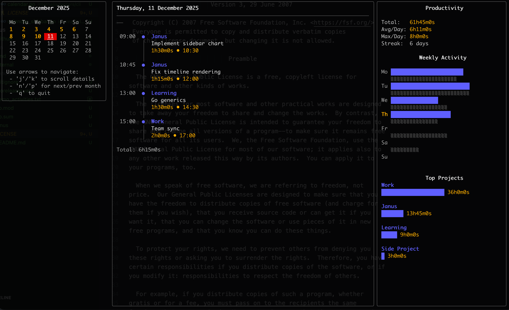
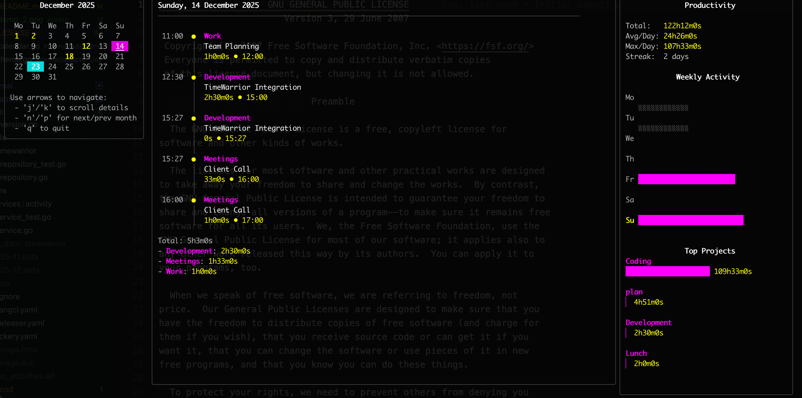

# Tock

[](https://github.com/kriuchkov/tock/releases) [](LICENSE) [](https://github.com/kriuchkov/tock/stargazers) [](go.mod) [](https://github.com/kriuchkov/tock/actions)

[Features](#features) • [Quick Start](#quick-start) • [Commands](#commands) •
[Configuration](#configuration) • [Theme](#theme) • [File Format](#file-format) • [Architecture](#architecture) • [Inspiration](#inspiration) • [License](#license)

## Features



**Tock** is a powerful time tracking tool for the command line. It saves activity logs as plaintext files and provides an interactive terminal UI for viewing your time.

Features include:

- 📝 **Simple plaintext format** - Activities stored in human-readable files
- 🎨 **Interactive TUI** - Beautiful terminal calendar view using Bubble Tea
- ⚡ **Fast & Lightweight** - Single binary, no dependencies
- 🔄 **Compatible** - Reads/writes Bartib file format and TimeWarrior data files
- 🎨 **Customizable Themes** - Multiple color themes and custom color support
- 📅 **iCal Export** - Generate .ics files for calendar integration, or sync with system calendars (macOS only)

<hr clear="right"/>

## Quick Start

### Installation

**Homebrew (macOS)**

```bash
brew tap kriuchkov/tap
brew install tock
```

**Go Install**

```bash
go install github.com/kriuchkov/tock/cmd/tock@latest
```

**Build from source**

```bash
go build -o tock ./cmd/tock
```

**Download Binary**

Download the latest release from the [Releases](https://github.com/kriuchkov/tock/releases) page.

### Basic Usage

Start tracking time:

```bash
tock start -d "Implementing features" -p "My Project"
```

Stop the current activity:

```bash
tock stop
```

View activities in interactive calendar:

```bash
tock list
```

## Configuration

Tock supports a flexible configuration system using YAML files and environment variables.

**Priority Order:**

1. Command-line flags
2. Environment variables
3. Configuration file (`~/.config/tock/tock.yaml` or `./tock.yaml`)
4. Default values

### Configuration File

Example `tock.yaml`:

```yaml
backend: file
file:
    path: /Users/user/tock.txt
theme:
    faint: '#404040'
    highlight: '#FFFF00'
    name: custom
    primary: '#FF00FF'
    secondary: '#00FFFF'
    sub_text: '#B0B0B0'
    text: '#FFFFFF'
timewarrior:
    data_path: /Users/user/.timewarrior/data
```

You can specify a custom config file path with the `--config` flag:

```bash
tock --config /path/to/tock.yaml list
```

Example a config file [tock.yaml.example](tock.yaml.example).

### Environment Variables

All settings can be overridden with environment variables (prefix `TOCK_`).

- `TOCK_BACKEND`: `file` or `timewarrior`
- `TOCK_FILE_PATH`: Path to activity log
- `TOCK_THEME_NAME`: Theme name (`dark`, `light`, `custom`)

### Storage Backends

Tock supports multiple storage backends.

### 1. Flat File (Default)

Stores activities in a simple plaintext file.

```bash
export TOCK_FILE_PATH="$HOME/.tock.txt"
```

### 2. TimeWarrior

Integrates with [TimeWarrior](https://timewarrior.net/) data files.

```bash
# Enable TimeWarrior backend
export TOCK_BACKEND="timewarrior"

# Optional: Specify custom data directory (default: ~/.timewarrior/data)
export TOCK_TIMEWARRIOR_DATA_PATH="/path/to/timewarrior/data"
```

Or use flags:

```bash
tock --backend timewarrior list
```

## Theming

Tock supports customizable color themes for the calendar view.

You can configure the theme in `tock.yaml`:

```yaml
theme:
  name: custom
  primary: "#ff0000"
```

Or use environment variables:

### Theme Name

Set `TOCK_THEME_NAME` (or `theme.name` in config) to one of:

- `dark`: Standard 256-color dark theme
- `light`: Standard 256-color light theme
- `ansi_dark`: 16-color dark theme
- `ansi_light`: 16-color light theme
- `custom`: Use custom colors defined by environment variables

### Auto-detection

If `theme.name` is not set, Tock automatically selects the best theme:

1. Detects terminal capabilities (TrueColor/256 vs ANSI).
2. Detects background color (Light vs Dark).
3. Selects the appropriate theme (e.g. `light` for light background, `ansi_dark` for dark ANSI terminal).

### Custom Colors

When `theme.name` is `custom`, you can override specific colors using these variables (accepts ANSI color codes or hex values):

```bash
export TOCK_THEME_NAME="custom"
export TOCK_COLOR_PRIMARY="63"   # Blue
export TOCK_COLOR_SECONDARY="196" # Red
export TOCK_COLOR_TEXT="255"     # White
export TOCK_COLOR_SUBTEXT="248"  # Light Grey
export TOCK_COLOR_FAINT="240"    # Dark Grey
export TOCK_COLOR_HIGHLIGHT="214" # Orange/Gold
```

### Example: Cyberpunk / Fuchsia Theme



```bash
export TOCK_THEME_NAME="custom"
export TOCK_COLOR_PRIMARY="#FF00FF"   # Fuchsia
export TOCK_COLOR_SECONDARY="#00FFFF" # Cyan
export TOCK_COLOR_TEXT="#FFFFFF"      # White
export TOCK_COLOR_SUBTEXT="#B0B0B0"   # Light Grey
export TOCK_COLOR_FAINT="#404040"     # Dark Grey
export TOCK_COLOR_HIGHLIGHT="#FFFF00" # Yellow
```

## Commands

```bash

A simple timetracker for the command line

Usage:
  tock [command]

Available Commands:
  add         Add a completed activity
  analyze     Analyze your productivity patterns
  calendar    Show interactive calendar view
  completion  Generate the autocompletion script for the specified shell
  continue    Continues a previous activity
  current     Lists all currently running activities
  help        Help about any command
  ical        Generate iCal (.ics) file for a specific task or all tasks in a day
  last        List recent unique activities
  list        List activities (Calendar View)
  report      Generate time tracking report
  start       Start a new activity
  stop        Stop the current activity
  version     Print the version info

Flags:
  -b, --backend string   Storage backend: 'file' (default) or 'timewarrior'
      --config string    Config file directory (default is $HOME/.config/tock/tock.yaml)
  -f, --file string      Path to the activity log file (or data directory for timewarrior)
  -h, --help             help for tock
  -v, --version          version for tock
Use "tock [command] --help" for more information about a command.
```

[**→ Commands Reference**](docs/commands.md)

### Start tracking

Start a new activity. Description and project are required.

```bash
tock start -p "Project Name" -d "Task description"
tock start -p "Project" -d "Task" -t 14:30  # Start at specific time
```

**Flags:**

- `-d, --description`: Activity description (required)
- `-p, --project`: Project name (required)
- `-t, --time`: Start time in HH:MM format (optional, defaults to now)

### Stop tracking

Stop the currently running activity.

```bash
tock stop
tock stop -t 17:00  # Stop at specific time
```

**Flags:**

- `-t, --time`: End time in HH:MM format (optional, defaults to now)

### Add past activity

Add a completed activity manually. Useful for logging time retroactively.

```bash
tock add -p "Project" -d "Task" -s 10:00 -e 11:00
tock add -p "Project" -d "Task" -s 14:00 --duration 1h30m
```

**Flags:**

- `-d, --description`: Activity description (required)
- `-p, --project`: Project name (required)
- `-s, --start`: Start time (HH:MM or YYYY-MM-DD HH:MM)
- `-e, --end`: End time (HH:MM or YYYY-MM-DD HH:MM)
- `--duration`: Duration (e.g. 1h, 30m). Used if end time is not specified.

### Continue activity

Continue a previously tracked activity. Useful for resuming work on a recent task.

```bash
tock continue          # Continue the last activity
tock continue 1        # Continue the 2nd to last activity
tock continue -d "New" # Continue last activity but with new description
```

**Flags:**

- `-d, --description`: Override description
- `-p, --project`: Override project
- `-t, --time`: Start time (HH:MM)

### Current activity

Show the currently running activity and its duration.

```bash
tock current
```

### Recent activities

List recent unique activities. Useful to find the index for `tock continue`.

```bash
tock last
tock last -n 20  # Show last 20 activities
```

**Flags:**

- `-n, --number`: Number of activities to show (default 10)

### Calendar View (TUI)

Open the interactive terminal calendar to view and analyze your time.

```bash
tock calendar
```

**Controls:**

- `Arrow Keys` / `h,j,k,l`: Navigate days
- `n`: Next month
- `p`: Previous month
- `q` / `Esc`: Quit

### Text Report

Generate a simple text report for a specific day.

```bash
tock report --today
tock report --yesterday
tock report --date 2025-12-01
```

**Flags:**

- `--today`: Report for today
- `--yesterday`: Report for yesterday
- `--date`: Report for specific date (YYYY-MM-DD)

### Calendar Integration (iCal)

Generate iCalendar (.ics) files for your tracked activities, compatible with Google Calendar, Apple Calendar, Outlook, etc.

**Single Activity Export:**

Use the unique key shown in `tock list` or `tock report` (format `YYYY-MM-DD-NN`).

```bash
tock ical 2026-01-07-01                    # Print ICS to stdout
tock ical 2026-01-07-01 > meeting.ics      # Save to file
tock ical 2026-01-07-01 --open             # Open in default calendar app (macOS)
```

**Bulk Export (All activities for a day):**

```bash
tock ical 2026-01-07 --path ./export       # Save all tasks for the day as separate ICS files
tock ical 2026-01-07 --open                # Combine all tasks and open in default calendar app (macOS)
```

**Flags:**

- `--path`: Output directory for .ics files (required for bulk export unless --open is used)
- `--open`: Automatically open generated file(s) in system calendar (macOS only)

### Productivity Analysis


Generate an analysis of your work habits, including Deep Work Score, Chronotype estimation, and Context Switching metrics.

**Metrics:**

- **Deep Work Score**: Percentage of time spent in focused sessions (>1h).
- **Chronotype**: Estimates your peak productivity time (Morning Lark, Night Owl, etc.).
- **Context Switching**: Measures fragmentation of your workday.
- **Session Distribution**: Breakdown of work sessions by duration.

<br>

```bash
tock analyze
tock analyze --days 7
```

**Flags:**

- `-n, --days`: Number of days to analyze (default 30)

## File Format

Activities are stored in plaintext format (compatible with Bartib):

```
  2025-12-10 09:00 - 2025-12-10 11:30 | Project Name | Task description
  2025-12-10 13:00 | Another Project | Ongoing task
```

You can edit this file manually with any text editor.

## Shell Completion

To enable shell completion (e.g. for Oh My Zsh):

1. Create a directory for the plugin:

```bash
mkdir -p ~/.oh-my-zsh/custom/plugins/tock
```

1. Generate the completion script:

```bash
tock completion zsh > ~/.oh-my-zsh/custom/plugins/tock/_tock
```

1. Add `tock` to your plugins list in `~/.zshrc`:

```bash
plugins=(... tock)
```

1. Restart your shell:

```bash
exec zsh
```

## Architecture

Tock follows Clean Architecture principles with clear separation of concerns:

```
cmd/tock/              # Application entry point
internal/
  core/                 # Domain layer
    models/             # Business entities
    ports/              # Interface definitions
    dto/                # Data transfer objects
    errors/             # Domain errors
  services/             # Application layer
    activity/           # Business logic implementation
    ics/                # iCal generation logic
  adapters/             # Infrastructure layer
    file/               # File repository (plaintext)
    cli/                # CLI commands & TUI views
    timewarrior/        # TimeWarrior repository
```

### Technology Stack

- **CLI Framework**: [Cobra](https://github.com/spf13/cobra)
- **TUI Components**: [Bubble Tea](https://github.com/charmbracelet/bubbletea), [Bubbles](https://github.com/charmbracelet/bubbles), [Lipgloss](https://github.com/charmbracelet/lipgloss)
- **Go Version**: 1.24+

### Project Structure

- `cmd/tock/main.go` - Entry point with DI setup
- `internal/core/` - Domain layer (models, interfaces, DTOs)
- `internal/services/` - Business logic
- `internal/adapters/file/` - File storage implementation
- `internal/adapters/timewarrior/` - TimeWarrior storage implementation
- `internal/adapters/cli/` - CLI commands and TUI

## Inspiration

Tock is inspired by and compatible with [Bartib](https://github.com/nikolassv/bartib) - an excellent time tracking tool written in Rust by Nikolas Schmidt-Voigt. It's saved me countless hours and helped me stay organized, so I wanted to create a similar tool in Go with a clean architecture approach and an interactive terminal UI.

## License

GPL-3.0-or-later
